|  | 
|-------------------------------------------------------------------------------------------------------|

| Main status |  |  |  |  |  |
|-------------|----------------------------------------------------------------------------------------------------------------------------------------------------------------------------------------------------------------------------|----------------------------------------------------------------------------------------------------------------------------------------------------------------------------------------------------------------------------------------------------------|-------------------------------------------------------------------------------------------------------------------------------------------------------------------------------------------------------------------------------------------------------|------------------------------------------------------------------------------------------------------------------------------------------------------------------------------------------------------------------------------------------------------------|------------------------------------------------------------------------------------------------------------------------------------------------------------------------------------------------------------------------------------------------------|
|             |                                                                                                                                                                                                                            |              |                                                                                                                                                                                                                                                       |                              |  |
|             |                                                                                                                                                                                                                            |           |                                                                                                                                                                                                                                                       |                                                                                                                                                                                                                                                            |                                                                                                                                                                                                                                                      |

| Dev status |  |  |  |  |  |
|------------|--------------------------------------------------------------------------------------------------------------------------------------------------------------------------------------------------------------------------------------|--------------------------------------------------------------------------------------------------------------------------------------------------------------------------------------------------------------------------------------------------------|-----------------------------------------------------------------------------------------------------------------------------------------------------------------------------------------------------------------------------------------------------|----------------------------------------------------------------------------------------------------------------------------------------------------------------------------------------------------------------------------------------------------------|----------------------------------------------------------------------------------------------------------------------------------------------------------------------------------------------------------------------------------------------------|
|            |                                                                                                                                                                                                                                      |              |                                                                                                                                                                                                                                                     |                              |  |
|            |                                                                                                                                                                                                                                      |           |                                                                                                                                                                                                                                                     |                                                                                                                                                                                                                                                          |                                                                                                                                                                                                                                                    |
# Architecture choisie

## Hexagonal Architecture

Pour mener à bien ce projet, je me suis inspiré de l'architecture hexagonal, qui permet un faible couplage entre
plusieurs composants.

Cela permet entre autre à l'application de pouvoir être **testé en isolation** de ses éventuels systèmes d'exécution de
base de données ou d'autres services.

Elle est également beaucoup plus maintenable et propice aux évolutions.

## Domain-Driven Design

Cette application a été conçu en utilisant une approche **DDD** (**Domain-Driven Design**). Cela fait référence à une
conception piloté par le métier.

De cette manière, l'application est séparée en plusieurs package, dont celui du domaine qui contient l'ensemble des
modèles relatifs au métier, et le package applicatif qui possède les services de ce même domaine.

## Staged event-driven architecture

L' **architecture événementielle par étapes** ( **SEDA** ) fait référence à une approche de l' architecture logicielle
qui décompose le cycle de vie d'un processus en un ensemble d'étapes reliées par des files d'attente.

Il évite la surcharge élevée associée aux threads basés sur les modèles de concurrence et découple la planification des
événements et des threads de la logique de l'application.

Chaque fonctionnalités de l'application sont gérées par un bus d'évènement principal, qui permet de relier ces
évènements à des observateurs présents dans une ou plusieurs autres fonctionnalités afin de pouvoir exécuter certaines
actions secondaire.

De cette manière, nous pouvons gérer grâce à un maillage entre événement et observateurs tout le comportement de nos
fonctionnalités entre elles sans que ces dernières ne communiquent jamais directement entre elle.

Un des nombreux avantages que cela représente et le découpage de notre application qui devient beaucoup plus simple, et
qui se prête naturellement aux **micro services**.

# Implémentation

## Dependency Inversion Principle

Le principe d'inversion des dépendances correspond au « **D** » de l'acronyme **SOLID**.

En suivant ce principe, la relation de dépendance conventionnelle que les modules de haut niveau ont, par rapport aux
modules de bas niveau, est inversée dans le but de rendre les premiers indépendants des seconds.

Les deux assertions de ce principe sont :

1. Les modules de haut niveau ne doivent pas dépendre des modules de bas niveau. Les deux doivent dépendre
   d'abstractions.
2. Les abstractions ne doivent pas dépendre des détails. Les détails doivent dépendre des abstractions.

Ce principe a été respecté pour cette application.

## Command Query Separation

La **séparation commande-requête** est un principe de la programmation impérative.

Elle stipule que chaque méthode doit être une ***commande*** qui effectue une action ou une ***requête*** qui renvoie
des données à l'appelant, mais pas les deux.

Plus formellement, les méthodes ne devraient retourner une valeur que si elles sont référentiellement transparentes et
ne possèdent donc pas d'effets de bord.

Ce principe a été respecté au maximum au sein de l'application, même les observateurs d'événements utilisent ce
principe.

## Packages

### Application

Le package applicatif contient le **traitement dit métier** de notre application.

Ce sont eux qui vont utiliser les différentes ressources de notre application pour **exécuter les traitements de leurs
propres domaines**.

Les services présents dans ce package se basent principalement sur les **interfaces** de nos autres classes afin de ne
pas être dépendants d'une implémentation en particulier. On peut faire ça grâce au **polymorphisme**, la **programmation
par interfaces** et le **pattern dependency injection**. Ces mêmes services sont des "micro-services" qui respecte le
fameux pattern **CQS** et sont donc des **Query** / **Command** handlers.

Cas d'utilisation, création d'un contractor :

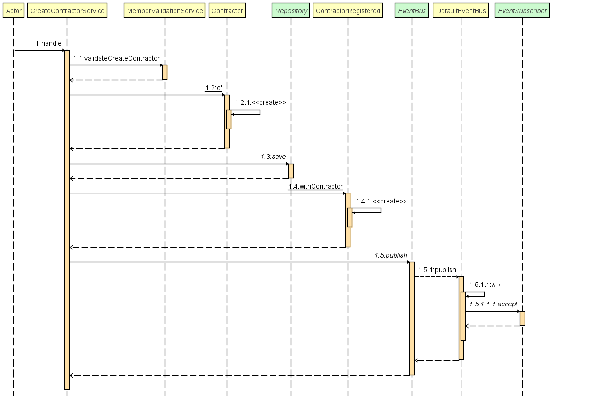

#### Event

Afin de pouvoir prendre en compte **différents traitements**, sans avoir à modifier le service et que ce dernier n'ai
qu'**une seule responsabilité**, ce dernier utilisera le **pattern event, observable** afin de lancer un événement lors
de différentes actions menés à l'intérieur d'un service. Ces mêmes événements seront alors pris en charge par des
observable (listener) un peu partout dans le programme, qui feront eux même appel à une command / requête pour
déclencher une action secondaire au traitement initial.

Les différentes tâches à exécuter suite à cet enregistrement n'auront alors qu'à **s'inscrire à cet événement** pour
lancer leur propre traitement.

Cas d'utilisation, création d'une facture suite à un paiement éffectué :

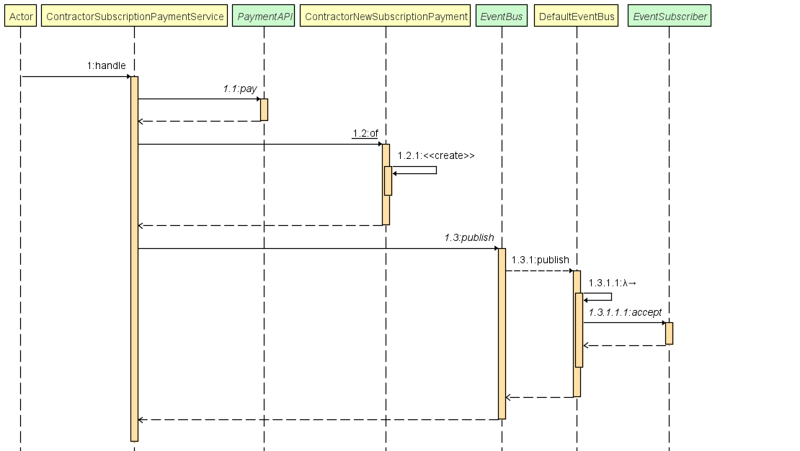

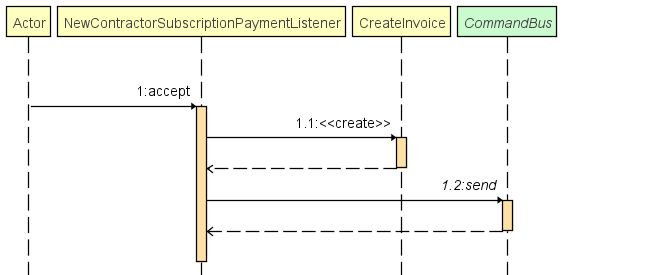

#### Exception handler

Ce package contient également des intercepteurs permettant d'intercepter les exceptions métiers lancés dans le programme
afin d'en avoir un traitement centralisé pour logger l'erreur et faire un retour adapté pour l'utilisateur.

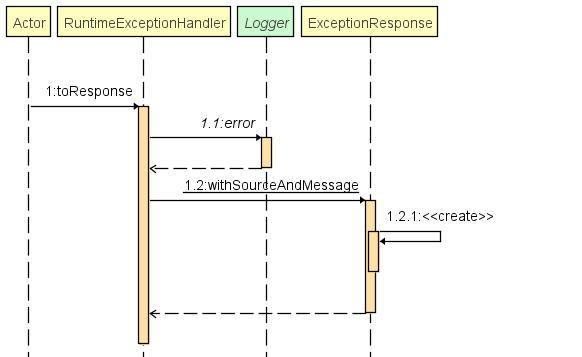

### API

Ce package est utilisé pour pouvoir avoir recours à des services externes en utilisant le **pattern strategy**.

L'interface est présente dans le package **api** et son implémentation dans **l'infrastructure**.

Pour le moment, une seule API est présente, celle du **paiement** qui peut potentiellement lancer une exception ou pas
pour indiquer si la transaction s'est bien effectué. elle est actuellement implémentée par un **stub** qui ne déclenche
pas d'exception (paiement effectué).

### Configuration

Ce package est celui qui permet le maillage entre toute nos interfaces et leurs implémentation, c'es lui qui va gérer le
contexte et l'injection de dépendances.

### Domain

Ce package contient tout les modèles du domaines métier de notre application. C'est également celui qui contient les
différentes interfaces qui peuvent être injectés dans nos services applicatifs (ex: Les interfaces des repositories).

#### Model

Ce package contient toute les entités utilisées dans l'application, elles suivent le **pattern value object** ainsi
qu'**entity**. L'objet est donc immutable et possède un identifiant pour son utilisation à travers un repository.

#### Exception

Contient les exceptions d'exécution du domaine métiers tel que **PaymentException** si le paiement a échoué, **
UserInvalidException** si l'utilisateur n'est pas valide et **UserNotFoundException** si l'utilisateur n'est pas présent
dans le repository implémenté.

### Features

Chaque fonctionnalités de notre application est séparée dans différents packages à l'intérieur du package feature.

Ces dernières ne peuvent utiliser les ressources uniquement de l'applications principal, mais jamais directement entre
elles. Une feature ne dépend jamais d'une autre feature.

Ces dernières reprennent chacune les différents packages (domain, infrastructure, kernel, ...) selon leurs besoins.

Actuellement il existe 3 features :

- **Invoices** qui gère la génération et récupération des factures lors d'un paiement d'un utilisateur

- **Member** qui gère les utilisateurs de TradeMe (CRUD)

- **Payment** qui s'occupe d'effectuer les paiement lorsque cela est nécessaire.

### Infrastructure

#### Repositories

Ce package permet d'avoir une **persistance des données** entités de l'application.

Pour cela on utilise le **pattern repository et strategy** afin de **séparer son interface**, qui restera dans le **
domaine**, de son implémentation dans **l'infrastructure**.

Actuellement l'implémentation stoque les entités en mémoire et se vide quand l'application s'arrête.

### Kernel

Ce package contient les différentes interfaces et leurs implémentations de fonctions "utilitaires" qui pourront être
exploité par nos services applicatifs et autre afin d'assurer un fonctionnement correct de notre application.

#### Validators

Apporte des fonctions utilitaire de validation de nos différentes entités du domaine.

Exemple : Lors de la vérification d'un champs, le programme jouera le diagramme de séquence suivant :

#### Command

Ce package contient la logique d'exécution d'une commande et le bus qui y est associé. Ce dernier possède sa propre
implémentation dans chaque features et est injecté grâce au package configuration qui aura configuré le maillage
correctement entre les commandes et les services associés.

Le comportement suivant est observé :

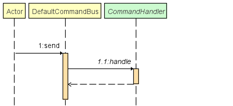

Création d'un contractor :

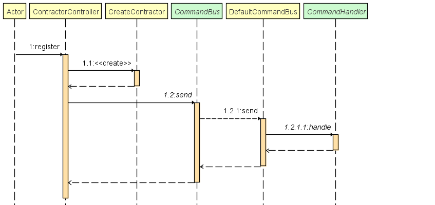

#### Query

Ce package contient la logique d'exécution d'une requête et le bus qui y est associé. Ce dernier possède sa propre
implémentation dans chaque features et est injecté grâce au package configuration qui aura configuré le maillage
correctement entre les requêteset les services associés.

Le comportement suivant est observé :

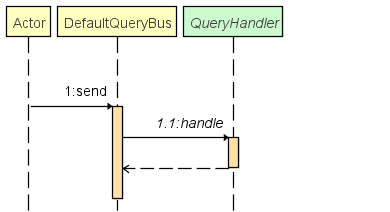

Récupération d'un contractor :

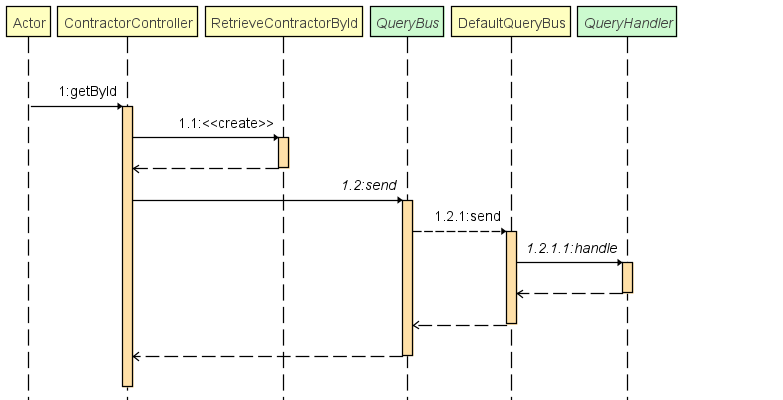

#### Event

Ce package est essentiel au bon déroulement de notre architecture SEDA !

Il contient la logique du bus d'événement qui permet à tous les observable de s'enregistrer à un événement. Ainsi
lorsque qu'un événement est publié, il est ensuite distribué à tout ses observateurs.

Comportement du bus d'événement par défaut :

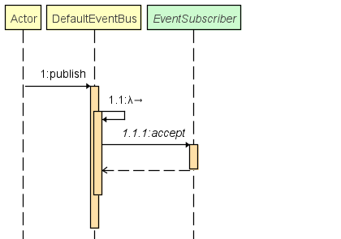

#### Logger

En utilisant le **pattern strategy** ainsi que **factory**, ce package permet à une classe d'obtenir un logger qui lui
est propre grâce au **LoggerFactory**. Les interfaces font parties du **domaine** et leurs implémentation de **
l'infrastructure**. Actuellement l'implémentation présente réutilise le la classe **Logger** **de Java**.

Une deuxième implémentation utilise le logger **JBoss** qui permet d'avoir des logs formattés autrement en console, en
plus de les écrire dans un fichier de logs en temps réel afin de garder une trace du comportement de l'aplication et des
éventuelles erreurs.

### Web

Ce package fournit une interface pour l'utilisateur afin qu'il puisse utiliser l'application à l'aide de requêtes REST.
Ce dernier utilise uniquement les command et les requête à travers leurs bus associé, et n'a pas connaissance de quoi
que ce soit d'autre dans l'application, ce qui lui permet d'avoir très peut de dépendance sur le fonctionnement global,
hormis les entités du domaine.

Cas d'utilisation, récupération des factures :

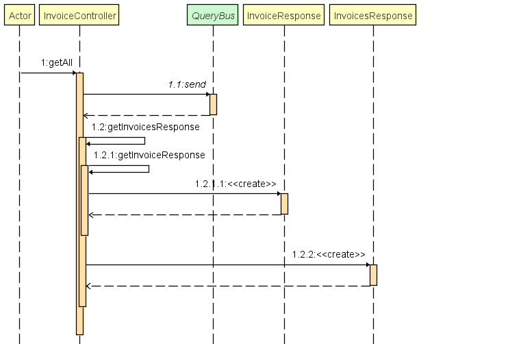

# Quarkus

Pour gagner en puissance dans notre application et avoir des controller web ainsi qu'une **injection de dépendance**
puissante, l'application est soutenu par le framework **Quarkus**.

Ce dernier sert à :

- Gérer les controller web ainsi que le sérialiseur / désérialiser JSON grâce à **Jackson**
- Configurer les différentes **bean** pour l'injection de dépendances au sein des différents services (package
  configuration)
- Gérer le **Scheduler** qui permet de lancer les paiements mensuels.
- Intégrer le logger **JBoss** plus facilement.
- Intégrer **Swagger** plus facilement grâce à des annotations sur les controller
- Gérer certains paramètre de l'application à la volée sans devoir recompiler le code tout le temps grâce à un fichier
  de configuration **application.properties** (configuration swagger, gestion du prix des abonnements, du jour de
  paiement, du formattage et du stockage des logs).

Le découpage de l'application en amont a permis une intégration très simple de Quarkus. L'application ne dépend pas de
quarkus mais utlise simplement le framework comme une implémentation de la solution.

## Dependency Injection

Dans le package configuration, les beans sont réparties dans différentes classes :

### GlobalConfiguration

C'est lui qui va injecter les bean dites "globals" tel que le logger ou encore la classe contenant les montants pour les
abonnements.

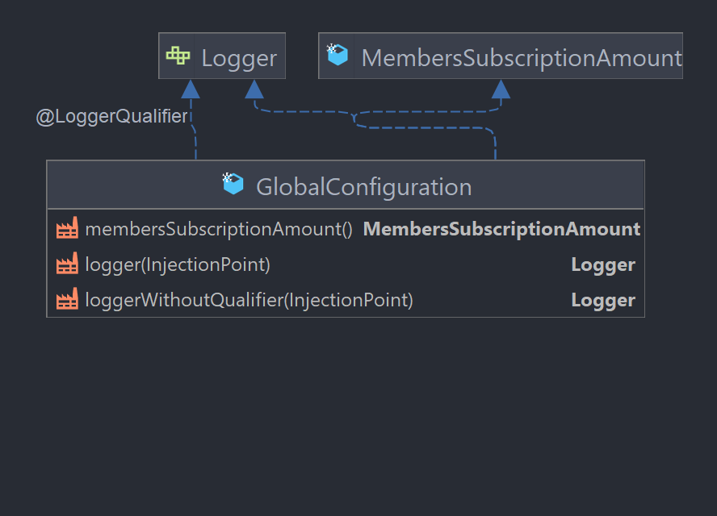

### APIConfiguration

Comme son nom l'indique, inject les différents API nécéssaire au bon foncitonnement de l'application, actuellement il
n'y a que l'API de paiement qui est injecté, mais d'autres peuvent être amené à être créés...

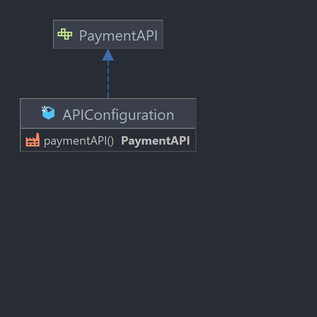

### CommandConfiguration

Injete les différents bus de commandes selon la feature, la configuration aura fait au préalable le maillage nécéssaire
entre les commandes et les services applicatifs.

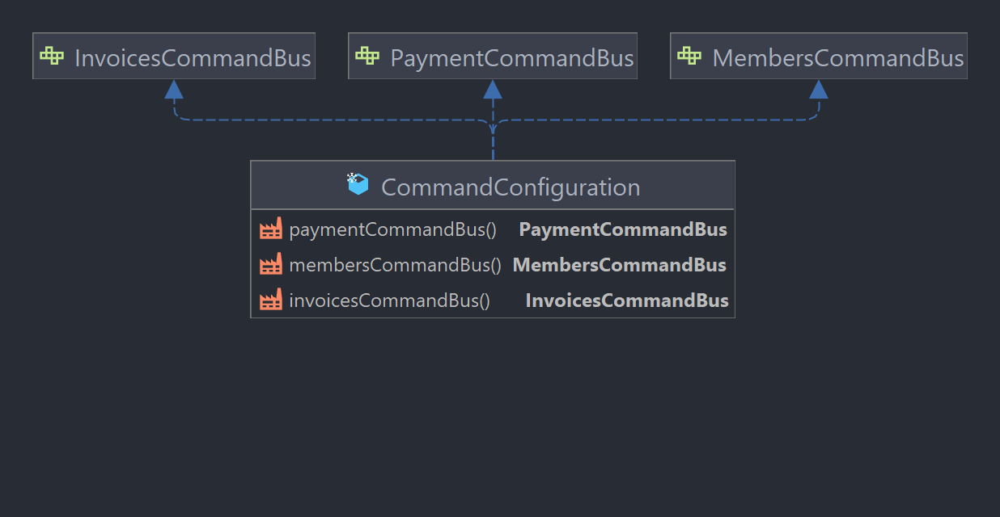

### QueryConfiguration

Injete les différents bus de requêtes selon la feature, la configuration aura fait au préalable le maillage nécéssaire
entre les requêtes et les services applicatifs.

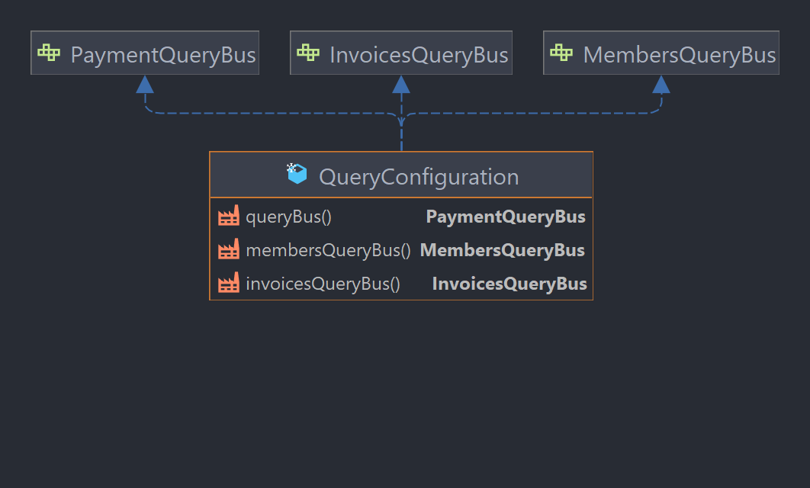

### EventConfiguration

Injete les différents bus d'événements selon le type d'événement (actuellement uniquement ceux du type **
ApplicationEvent**, la configuration aura fait au préalable le maillage nécéssaire entre les événements et les
observateurs.

| 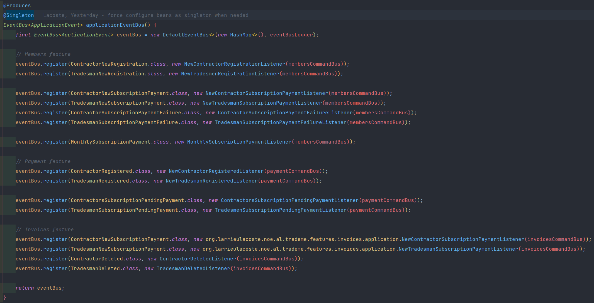 | 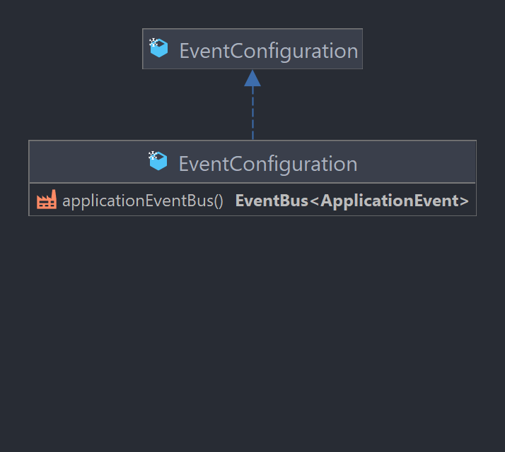 |
| ------------------------------------------------------------ | ------------------------------------------------------------ |

### RepositoryConfiguration

Injecte les différents repositories au sein des services qui en ont besoin :

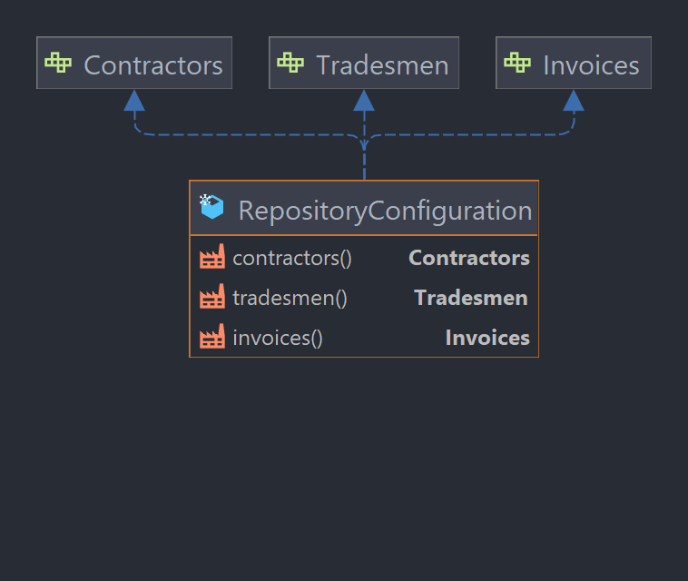

# Tests unitaires

Afin d'assurer le bon fonctionnement et grâce au découpage de nos composants, l'application est couverte par des tests
unitaires ( qui se lancent d'ailleurs automatiquement à chaque push sur github grâce à des **actions de CI** )

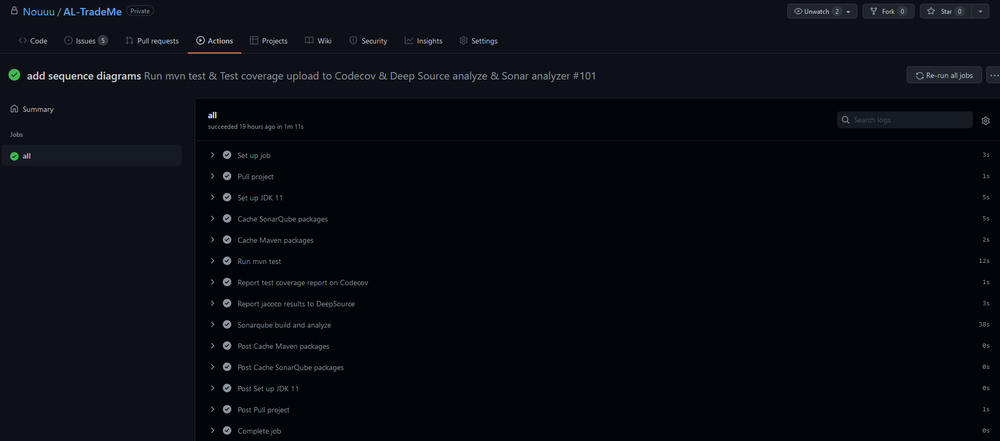

| Branche DEV                                                  | Branch MAIN                                                  |
| ------------------------------------------------------------ | ------------------------------------------------------------ |
|  |  |
|  |  |

# Swagger

Lorsque l'application est lancé avec le profil **dev** cette dernière rend accessible une page web swagger-ui afin de
pouvoir tester directement nos interfaces REST et visualiser nos entités pour les requêtes, ainsi que ceux en réponse.

Le swagger est accessible à l'adresse suivante : http://localhost:8080/q/swagger-ui/#/

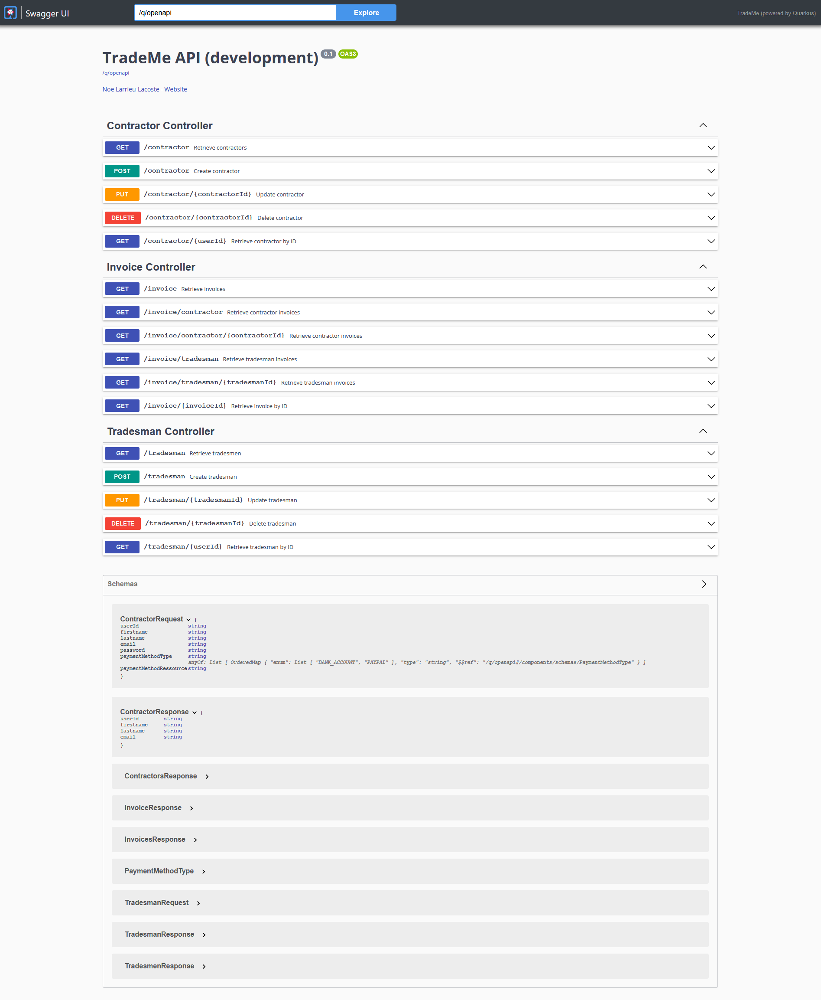

# SonarQube

Pour assurer un code propre, le code de l'application est analysé à chaque mise à jour par un serveur Sonarqube
auto-hébergé (https://sonar.nospy.fr) pour assurer que le code rempli bien les critères de maintenabilité, sécurité,
fiablité, ...

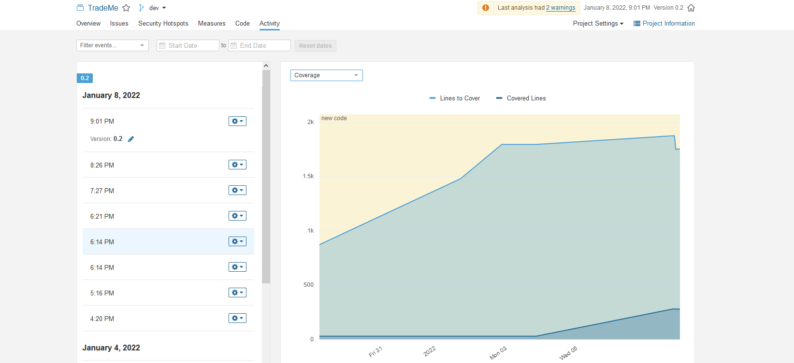

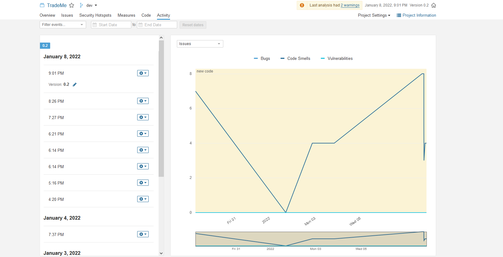

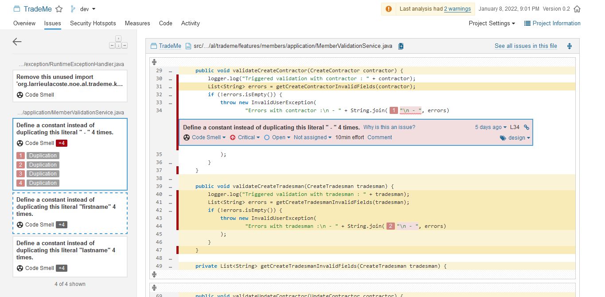
