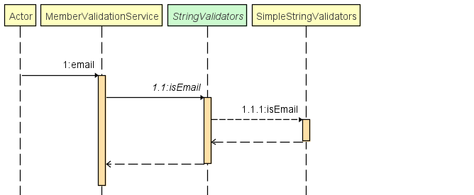
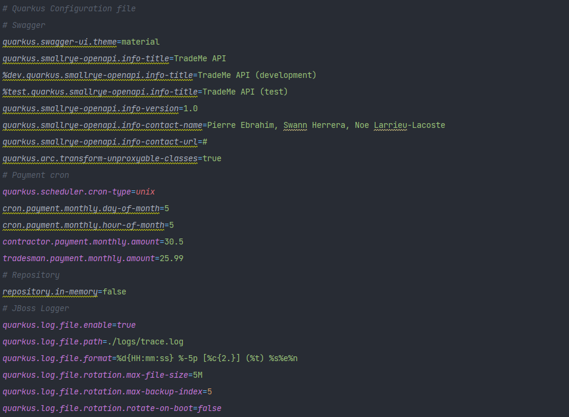
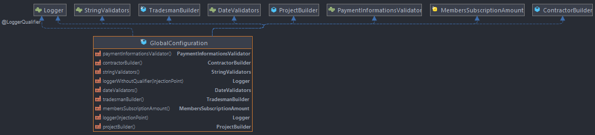
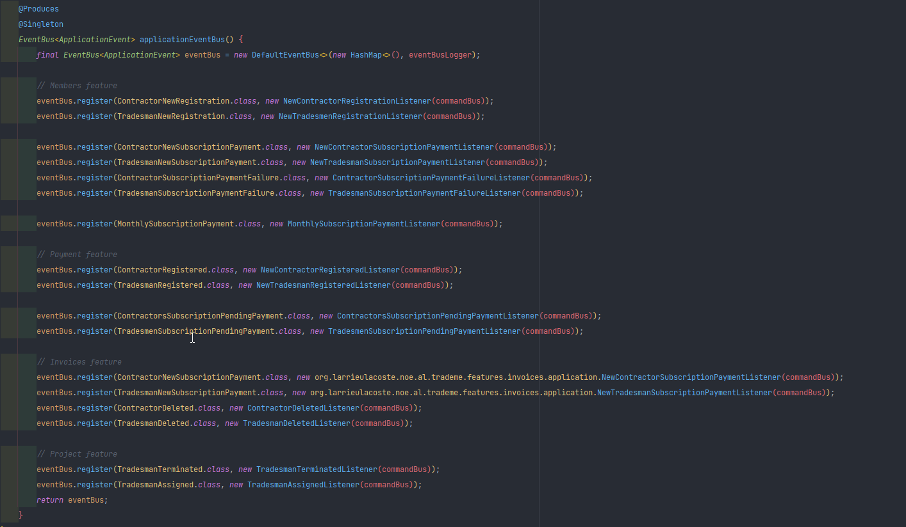
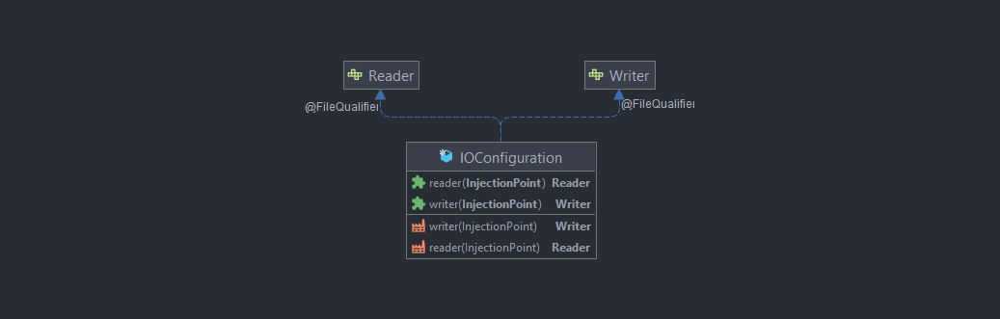
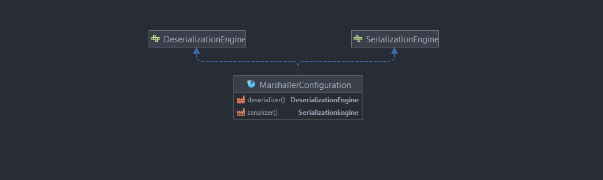
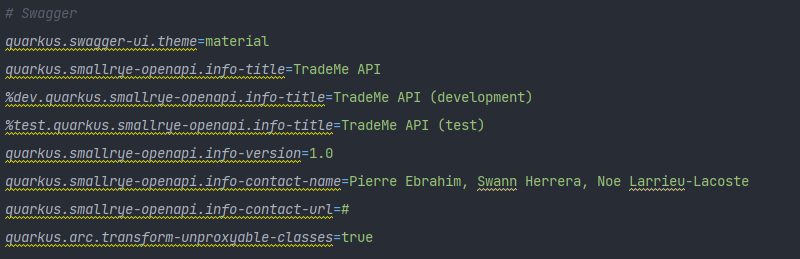
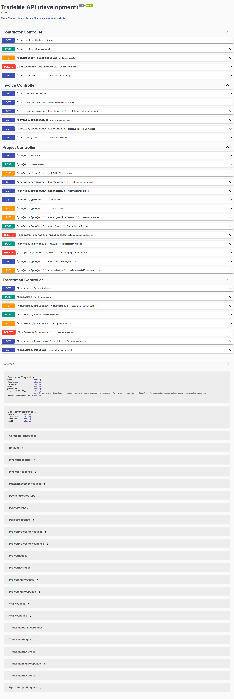
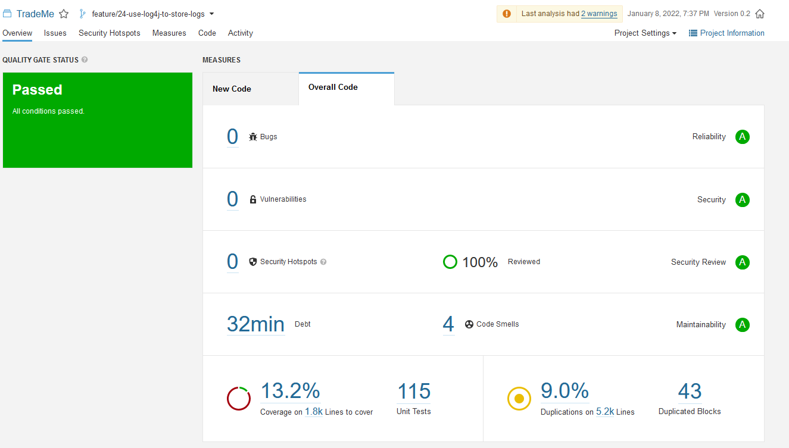

|  | 
|-------------------------------------------------------------------------------------------------------|

| Main status |  |  |  |  |  |
|-------------|----------------------------------------------------------------------------------------------------------------------------------------------------------------------------------------------------------------------------|----------------------------------------------------------------------------------------------------------------------------------------------------------------------------------------------------------------------------------------------------------|-------------------------------------------------------------------------------------------------------------------------------------------------------------------------------------------------------------------------------------------------------|------------------------------------------------------------------------------------------------------------------------------------------------------------------------------------------------------------------------------------------------------------|------------------------------------------------------------------------------------------------------------------------------------------------------------------------------------------------------------------------------------------------------|
|             |                                                                                                                                                                                                                            |              |                                                                                                                                                                                                                                                       |                              |  |
|             |                                                                                                                                                                                                                            |           |                                                                                                                                                                                                                                                       |                                                                                                                                                                                                                                                            |                                                                                                                                                                                                                                                      |

| Dev status |  |  |  |  |  |
|------------|--------------------------------------------------------------------------------------------------------------------------------------------------------------------------------------------------------------------------------------|--------------------------------------------------------------------------------------------------------------------------------------------------------------------------------------------------------------------------------------------------------|-----------------------------------------------------------------------------------------------------------------------------------------------------------------------------------------------------------------------------------------------------|----------------------------------------------------------------------------------------------------------------------------------------------------------------------------------------------------------------------------------------------------------|----------------------------------------------------------------------------------------------------------------------------------------------------------------------------------------------------------------------------------------------------|
|            |                                                                                                                                                                                                                                      |              |                                                                                                                                                                                                                                                     |                              |  |
|            |                                                                                                                                                                                                                                      |           |                                                                                                                                                                                                                                                     |                                                                                                                                                                                                                                                          |                                                                                                                                                                                                                                                    |
# Plan

<!-- toc -->

[TOC]

# Fonctionnalités métiers

## Membres

- Ajouter / Modifier / Supprimer un **Contractor**
- Ajouter / Modifier / Supprimer un **Tradesman**
- Faire une demande de paiement pour un **Contractor**
- Faire une demande de paiement pour un **Tradesman**
- Libérer un **Tradesman** d'un **Projet**
- Assigner un **Tradesman** à un **Projet**
- Mettre à jour les attributs professionnel d'un **Tradesman**
- Mettre à jour le statut de paiement d'un **Tradesman**
- Mettre à jour le statut de paiement d'un **Contractor**
- Trouver un **Tradesman** qui match pour un **Projet**
- Récupérer un **Tradesman**
- Récupérer tout les **Tradesman**
- Récupérer les compétences d'un **Tradesman**
- Récupérer un **Contractor**
- Récupérer tout les **Contractor**

## Paiement

- Payer un abonnement pour un **Contractor**
- Payer un abonnement pour un **Tradesman**

## Factures

- Créer une **facture**
- Supprimer les **factures** d'un **Contractor**
- Supprimer les **factures** d'un **Tradesman** 
- Récupérer toute les **factures**
- Récupérer les **factures** des **Tradesman**
- Récupérer les **factures** des **Contractor**
- Récupérer les **factures** d'un **Tradesman**
- Récupérer les **factures** d'un **Contractor**
- Récupérer une **facture**

## Projets

- Ajouter / Modifier un **Projet**
- Terminer un **Projet**
- Ajouter / Retirer un métier au **Projet**
- Ajouter / Modifier / Retirer une compétence requise à un **Projet**
- Assigner un **Tradesman** à un **Projet**
- Enlever un **Tradesman** du **Projet**
- Récupérer les **Projets**
- Récupérer un **Projet**
- Récupérer les **Projets** d'un **Contractor**
- Récupérer les **Projets** d'un **Tradesman**
- Récupérer les compétences requises d'un **Projet**

# Architecture choisie

## Hexagonal Architecture

Pour mener à bien ce projet, je me suis inspiré de l'architecture hexagonale, qui permet un faible couplage entre plusieurs composants.

Cela permet entre autre à l'application de pouvoir être **testé en isolation** de ses éventuels systèmes d'exécution de base de données ou d'autres services.

Elle est également beaucoup plus maintenable et propice aux évolutions.

## Domain-Driven Design

Cette application a été conçue en utilisant une approche **DDD** (**Domain-Driven Design**). Cela fait référence à une conception pilotée par le métier.

De cette manière, l'application est séparée en plusieurs packages, dont celui du domaine qui contient l'ensemble des modèles relatifs au métier et le package applicatif qui possède les services de ce même domaine.

## Staged event-driven architecture

L'**architecture événementielle par étapes** (**SEDA**) fait référence à une approche de l'architecture logicielle qui décompose le cycle de vie d'un processus en un ensemble d'étapes reliées par des files d'attente.

Il évite la surcharge élevée associée aux threads basés sur les modèles de concurrence et découple la planification des événements et des threads de la logique de l'application.

Chaque fonctionnalité de l'application est gérée par un bus d'évènement principal, qui permet de relier ces évènements à des observateurs présents dans une ou plusieurs autres fonctionnalités afin de pouvoir exécuter certaines
actions secondaire.

De cette manière, nous pouvons gérer grâce à un maillage entre événement et observateurs tout le comportement de nos fonctionnalités entre elles sans que ces dernières ne communiquent jamais directement entre elle.

Un des nombreux avantages que cela représente et le découpage de notre application qui devient beaucoup plus simple, et qui se prête naturellement aux **micro services**.

## Architectural Decision Record

Voilà quelques décisions d'architecture que nous avons pris pendant le développement du projet :

- [Communications externes](Architectural-Decision/external-communication.md)
- [Communications internes](Architectural-Decision/internal-communication.md)
- [Service VS Command/Query Handler](Architectural-Decision/service-vs-command-handler.md)
- [Utilisation des records](Architectural-Decision/utilisation-des-records.md)
- [Validation](Architectural-Decision/validation.md)

# Implémentation

## Dependency Inversion Principle

Le principe d'inversion des dépendances correspond au « **D** » de l'acronyme **SOLID**.

En suivant ce principe, la relation de dépendance conventionnelle que les modules de haut niveau ont, par rapport aux modules de bas niveau, est inversée dans le but de rendre les premiers indépendants des seconds.

Les deux assertions de ce principe sont :

1. Les modules de haut niveau ne doivent pas dépendre des modules de bas niveau. Les deux doivent dépendre d'abstractions.
2. Les abstractions ne doivent pas dépendre des détails. Les détails doivent dépendre des abstractions.

Ce principe a été respecté pour cette application.

## Command Query Separation

La **séparation commande-requête** est un principe de la programmation impérative.

Elle stipule que chaque méthode doit être une ***commande*** qui effectue une action ou une ***requête*** qui renvoie des données à l'appelant, mais pas les deux.

Plus formellement, les méthodes ne devraient retourner une valeur que si elles sont référentiellement transparentes et ne possèdent donc pas d'effets de bord.

Ce principe a été respecté au maximum au sein de l'application, même les observateurs d'événements utilisent ce principe.

## Packages

### Application

Le package applicatif contient le **traitement dit métier** de notre application.

Ce sont eux qui vont utiliser les différentes ressources de notre application pour **exécuter les traitements de leurs propres domaines**

Les services présents dans ce package se basent principalement sur les **interfaces** de nos autres classes afin de ne pas être dépendants d'une implémentation en particulier. On peut faire ça grâce au **polymorphisme**, la **programmation par interfaces** et le **pattern dependency injection**. Ces mêmes services sont des "micro-services" qui respecte le fameux pattern **CQS** et sont donc des **Query** / **Command** handlers.

Cas d'utilisation, création d'un contractor :

### API

Ce package est utilisé pour pouvoir avoir recours à des services externes en utilisant le **pattern strategy**.

L'interface est présente dans le package **api** et son implémentation dans **l'infrastructure**.

Pour le moment, une seule API est présente, celle du **paiement** qui peut potentiellement lancer une exception ou pas pour indiquer si la transaction s'est bien effectué. Elle est actuellement implémentée par un **stub** qui ne déclenche pas d'exception (paiement effectué).

### Configuration

Ce package est celui qui permet le maillage entre toutes nos interfaces et leurs implémentations, c'est lui qui va gérer le contexte et l'injection de dépendances.

### Domain

Ce package contient tous les modèles du domaine métier de notre application. C'est également celui qui contient les différentes interfaces qui peuvent être injectés dans nos services applicatifs (ex : Les interfaces des repositories).

#### Event

Afin de pouvoir prendre en compte **différents traitements**, sans avoir à modifier le service et que ce dernier n'ai qu'**une seule responsabilité**, on utilisera le **pattern event, observable** afin de lancer un événement lors de différentes actions menés à l'intérieur d'un service. 

Ces mêmes événements seront alors pris en charge par des observables (listener) un peu partout dans le programme, qui feront eux même appel à une command / requête pour déclencher une action secondaire au traitement initial.

Les différentes tâches à exécuter suite à cet enregistrement n'auront alors qu'à **s'inscrire à cet événement** pour lancer leur propre traitement.

Cas d'utilisation, création d'une facture suite à un paiement effectué :

#### Model

Ce package contient toutes les entités utilisées dans l'application, elles suivent le **pattern value object** ainsi qu'**entity**. L'objet est donc immutable et possède un identifiant pour son utilisation à travers un repository.

#### Exception

Contient les exceptions d'exécution du domaine métiers tel que **PaymentException** si le paiement a échoué, **UserInvalidException** si l'utilisateur n'est pas valide et **UserNotFoundException** si l'utilisateur n'est pas présent dans le repository implémenté.

### Features

Chaque fonctionnalité de notre application est séparée dans différents packages à l'intérieur du package feature.

Ces dernières ne peuvent utiliser les ressources uniquement de l'application principale, mais jamais directement entre elles. Une feature ne dépend jamais d'une autre feature.

Ces dernières reprennent chacune les différents packages (domain, infrastructure, kernel, ...) selon leurs besoins.

Actuellement, il existe 3 features :

- **Invoices** qui gère la génération et récupération des factures lors d'un paiement d'un utilisateur
- **Member** qui gère les utilisateurs de TradeMe (CRUD)
- **Payment** qui s'occupe d'effectuer les paiements lorsque cela est nécessaire.
- **Projects** qui gère les projets de l'application

### Infrastructure

#### Repositories

Pour cela on utilise le **pattern repository et strategy** afin de **séparer son interface**, qui restera dans le **domaine**, de son implémentation dans **l'infrastructure**.

Actuellement, il existe deux implémentations de cette interface :

- Une en mémoire : les entités en mémoire et se vide quand l'application s'arrête.
- Une grâce à un fichier JSON, qui persiste à arrêt de l'application et se charge au démarrage.

Il est possible de switcher entre l'un et l'autre grâce à la propriété `repository.in-memory=true|false` dans le fichier `application.properties`

### Kernel

Ce package contient les différentes interfaces et leurs implémentations de fonctions "utilitaires" qui pourront être exploité par nos services applicatifs et autre afin d'assurer un fonctionnement correct de notre application.

#### IO

Ce package nous permet d'avoir les interfaces **Reader** et **Writer** qui vont nous permettre d'interagir avec différents contenus, tel que des fichiers par exemple.

Il y a actuellement deux implémentations pour chacune de ces interfaces. Les deux permettent accéder à des fichier.

#### Marshaller

Le package marshaller met à disposition une interface de **Sérialisation** et de **Désérialisation** de nos objets vers une chaine de caractères.

Actuellement il existe une implémentation de chaque pour le format **JSON**.

#### Exception handler

Ce package contient également des intercepteurs permettant d'intercepter les exceptions métiers lancés dans le programme afin d'en avoir un traitement centralisé pour logger l'erreur et faire un retour adapté pour l'utilisateur.

#### Validators

Apporte des fonctions utilitaires de validation de nos différentes entités du domaine.

Exemple : Lors de la vérification des champs, le programme jouera le diagramme de séquence suivant :

#### Command

Ce package contient la logique d'exécution d'une commande et le bus qui y est associé. Ce dernier possède une implémentation globale à chaque features et est injecté grâce au package configuration qui aura configuré le maillage
correctement entre les commandes et les services associés.

Le comportement suivant est observé :

Création d'un contractor :

#### Query

Ce package contient la logique d'exécution d'une requête et le bus qui y est associé. Ce dernier possède une implémentation globale à chaque features et est injecté grâce au package configuration qui aura configuré le maillage
correctement entre les requêtes et les services associés. Le comportement suivant est observé :

Récupération d'un contractor :

#### Event

Ce package est essentiel au bon déroulement de notre architecture SEDA !

Il contient la logique du bus d'événement qui permet à tous les observables de s'enregistrer à un événement. Ainsi, lorsque qu'un événement est publié, il est ensuite distribué à tous ses observateurs.

Comportement du bus d'événement par défaut :

#### Logger

En utilisant le **pattern strategy** ainsi que **factory**, ce package permet à une classe d'obtenir un logger qui lui est propre grâce au **LoggerFactory**. Les interfaces font parties du **domaine** et leurs implémentations de **l'infrastructure**. Actuellement l'implémentation présente réutilise le la classe **Logger** **de Java**.

Une deuxième implémentation utilise le logger **JBoss** qui permet d'avoir des logs formattés autrement en console, en plus de les écrire dans un fichier de logs en temps réel afin de garder une trace du comportement de l'application et des éventuelles erreurs.

### Shared kernel

Ce package est présent sur le niveau le plus haut de l'application, avant les **features**. Ce dernier contient les entités qui sont partagées entre les différents usecases.

### Web

Ce package fournit une interface pour l'utilisateur afin qu'il puisse utiliser l'application à l'aide de requêtes REST.
Ce dernier utilise uniquement les command et les requêtes à travers leurs bus associé, et n'a pas connaissance de quoi que ce soit d'autre dans l'application, ce qui lui permet d'avoir très peu de dépendance sur le fonctionnement global, hormis les entités du domaine.

Cas d'utilisation, récupération des factures :

# Quarkus

Pour gagner en puissance dans notre application et avoir des controller web ainsi qu'une **injection de dépendance**
puissante, l'application est soutenue par le framework **Quarkus**.

Ce dernier sert à :

- Gérer les controller web ainsi que le sérialiseur / désérialiser JSON grâce à **Jackson**

- Configurer les différentes **bean** pour l'injection de dépendances au sein des différents services (package configuration)

- Gérer le **Scheduler** qui permet de lancer les paiements mensuels.

- Intégrer le logger **JBoss** plus facilement.

- Intégrer **Swagger** plus facilement grâce à des annotations sur les controller

- Gérer certain paramètre de l'application à la volée sans devoir recompiler le code tout le temps grâce à un fichier de configuration **application.properties** (configuration swagger, gestion du prix des abonnements, du jour de paiement, du formatage et du stockage des logs).

  

Le découpage de l'application en amont a permis une intégration très simple de Quarkus. L'application ne dépend pas de quarkus mais utilise simplement le framework comme une implémentation de la solution.

## Dependency Injection

Dans le package configuration, les beans sont réparties dans différentes classes :

### GlobalConfiguration

C'est lui qui va injecter les bean dites "globales" tel que le logger ou encore la classe contenant les montants pour les abonnements.

### APIConfiguration

Comme son nom l'indique, inject les différents API nécessaires au bon fonctionnement de l'application, actuellement il n'y a que l'API de paiement qui est injecté, mais d'autres peuvent être amené à être créés...

### CommandConfiguration

Injecte les différents bus de commandes selon la feature, la configuration aura fait au préalable le maillage nécessaire entre les commandes et les services applicatifs.

### QueryConfiguration

Injecte les différents bus de requêtes selon la feature, la configuration aura fait au préalable le maillage nécessaire entre les requêtes et les services applicatifs.

### EventConfiguration

Injecte les différents bus d'événements selon le type d'événement (actuellement uniquement ceux du type **ApplicationEvent**), la configuration aura fait au préalable le maillage nécessaire entre les événements et les observateurs.

|  |  |
| ------------------------------------------------------------ | ------------------------------------------------------------ |

### RepositoryConfiguration

Injecte les différents repositories au sein des services qui en ont besoin :

### IOConfiguration

Injecte l'implémentation choisi pour nos Reader et Writer :

### MarshallerConfiguration

Injecte l'implémentation choisi pour notre Sérialiser et Désérialiser : 

# Tests unitaires

Afin d'assurer le bon fonctionnement et grâce au découpage de nos composants, l'application est couverte par des tests unitaires (qui se lancent d'ailleurs automatiquement à chaque push sur github grâce à des **actions de CI**). Nous utilisons CodeCov pour analyser les rapports de tests unitaires au moment de push ou de pull requests

| Branche DEV                                                  | Branch MAIN                                                  |
| ------------------------------------------------------------ | ------------------------------------------------------------ |
|  |  |
|  |  |

# Swagger

Lorsque l'application est lancée avec le profil **dev** ou **test** cette dernière rend accessible une page web swagger-ui afin de pouvoir tester directement nos interfaces REST et visualiser nos entités pour les requêtes, ainsi que ceux en réponse.

Le Swagger est configurables grâce à quelques propriétés dans le fichier `application.properties` :

Le Swagger est accessible à l'adresse suivante lorsque l'application est lancée : http://localhost:8080/q/swagger-ui/#/

# SonarQube

Pour assurer un code propre, le code de l'application est analysé à chaque mise à jour par un serveur Sonarqube autohébergé (https://sonar.nospy.fr) pour assurer que le code rempli bien les critères de maintenabilité, sécurité,
fiabilité, ...

